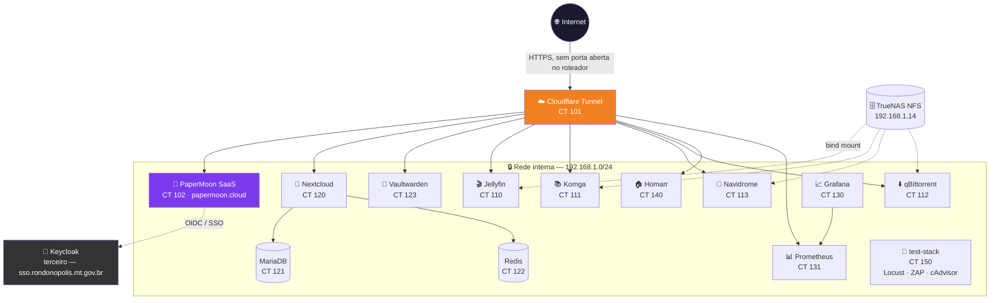

# 🌙 PaperMoon Platform

**Infraestrutura como código de ponta a ponta para um homelab de nível corporativo** — Proxmox VE + Terraform + Ansible + Docker Compose, hospedando 14 serviços em produção real, incluindo um SaaS público (`papermoon.cloud`) com SSO corporativo via Keycloak.


> Reconstruir a plataforma inteira, do zero, com dois comandos:
> ```bash
> terraform apply
> ansible-playbook site.yml
> ```
> Nenhum container nasce fora do Terraform. Nenhuma configuração é feita "na mão" via SSH. Todo segredo é rastreável e recuperável (Ansible Vault + Git).

---

## 📐 Arquitetura



**Camadas, cada uma com uma responsabilidade só:**

| Camada | Responsabilidade | Nunca faz |
|---|---|---|
| 🏗️ **Terraform** | Cria LXCs: CPU, RAM, disco, IP, bind mounts | Instalar software, configurar app |
| ⚙️ **Ansible** | Sistema operacional, Docker Engine, firewall, deploy das stacks | Criar/destruir infraestrutura |
| 🐳 **Docker Compose** | Roda a aplicação em si, isolada por container | Persistir configuração fora de volume/env |

---

## 🗺️ Serviços em produção

| | Serviço | CT | Pra que serve | Acesso | Banco |
|---|---|---|---|---|---|
| ☁️ | **Cloudflare Tunnel** | 101 | Ingress público único — todo domínio `*.papermoon.cloud` passa por aqui | *(infra, sem UI)* | — |
| 🌙 | **[PaperMoon](docker/papermoon/)** | 102 | SaaS de infraestrutura gerenciada — o produto real da plataforma | **[papermoon.cloud](https://papermoon.cloud)** | PostgreSQL |
| 🎬 | **[Jellyfin](docker/jellyfin/)** | 110 | Streaming de filmes/séries (Netflix self-hosted) | [jellyfin.papermoon.cloud](https://jellyfin.papermoon.cloud) | SQLite |
| 📚 | **[Komga](docker/komga/)** | 111 | Servidor de manga/quadrinhos/ebooks | [komga.papermoon.cloud](https://komga.papermoon.cloud) | interno |
| ⬇️ | **[qBittorrent](docker/qbittorrent/)** | 112 | Cliente de torrent com WebUI | [torrent.papermoon.cloud](https://torrent.papermoon.cloud) | — |
| 🎵 | **[Navidrome](docker/navidrome/)** | 113 | Streaming de música (Spotify self-hosted) | [navidrome.papermoon.cloud](https://navidrome.papermoon.cloud) | SQLite |
| 📁 | **[Nextcloud](docker/nextcloud/)** | 120 | Arquivos e colaboração (Google Drive self-hosted) | [nextcloud.papermoon.cloud](https://nextcloud.papermoon.cloud) | MariaDB + Redis |
| 🗃️ | **[MariaDB](docker/nextcloud-mariadb/)** | 121 | Banco dedicado do Nextcloud | *(sem acesso direto)* | — |
| ⚡ | **[Redis](docker/nextcloud-redis/)** | 122 | Cache/lock do Nextcloud | *(sem acesso direto)* | — |
| 🔐 | **[Vaultwarden](docker/vaultwarden/)** | 123 | Gerenciador de senhas compatível Bitwarden | [vault.papermoon.cloud](https://vault.papermoon.cloud) | SQLite |
| 📈 | **[Grafana](docker/grafana/)** | 130 | Dashboards de métricas da frota inteira | `192.168.1.130:3000` ⚠️ *(rota pública com problema — ver seção "Pendências conhecidas" abaixo)* | SQLite |
| 📊 | **[Prometheus](docker/prometheus/)** | 131 | Coleta métricas de todos os 14 hosts | [prometheus.papermoon.cloud](https://prometheus.papermoon.cloud) | TSDB |
| 🏠 | **[Homarr](docker/homarr/)** | 140 | Portal central — dashboard com link pra tudo acima | [home.papermoon.cloud](https://home.papermoon.cloud) | SQLite |
| 🧪 | **[test-stack](docker/test-stack/)** | 150 | Locust + OWASP ZAP + cAdvisor — teste de carga/segurança isolado | `192.168.1.150:{8089,8080,8081}` | — |

Cada linha tem um `README.md` próprio com **credenciais** (ou onde encontrá-las), decisões técnicas e troubleshooting específico — clique no nome do serviço.

---

## 🚀 Quickstart

```bash
# 1. Bootstrap (uma vez, no Proxmox) — NFS, usuário Terraform, template LXC, Tailscale
cd bootstrap && ./01-nfs-storage.sh && ./02-terraform-user.sh && ./03-lxc-template.sh && ./04-tailscale.sh

# 2. Terraform — cria os 14 LXCs
cd terraform/environments/production
cp terraform.tfvars.example terraform.tfvars   # preencher com valores reais
terraform init && terraform plan && terraform apply

# 3. Ansible — configura o sistema + faz deploy de cada stack
cd ansible
ansible-galaxy install -r requirements.yml
ansible-playbook site.yml -e ansible_user=root   # só na primeira vez (hosts novos)
ansible-playbook playbooks/deploy-<app>.yml       # 1 vez por serviço, ex: deploy-jellyfin.yml
```

Guia fase a fase completo: [`docs/bootstrap.md`](docs/bootstrap.md) → [`docs/terraform.md`](docs/terraform.md) → [`docs/ansible.md`](docs/ansible.md) → [`docs/docker.md`](docs/docker.md).

---

## 📊 Números reais do host

| | |
|---|---|
| **Hardware** | AMD Ryzen 5 PRO 4650G · 6 núcleos/12 threads · GPU Radeon (passthrough VAAPI no Jellyfin) |
| **RAM** | ~15,3GB utilizáveis · ~14,75GB alocados entre os 14 LXCs (**~3,6% de folga**) |
| **Storage** | TrueNAS via NFS (2 pools independentes) para mídia; discos locais do LXC para bancos/config |
| **Rede** | `192.168.1.0/24` — convenção `IP = 192.168.1.<CT ID>` |
| **Ingress** | Cloudflare Tunnel — zero portas abertas no roteador |

Tabela completa de `cores`/`memory_mb` por container e o racional de cada tamanho: [`docs/terraform.md`](docs/terraform.md).

---

## 📂 Estrutura do repositório

```
PaperMoon-Platform/
├── bootstrap/    # preparo one-time do host Proxmox (NFS, usuário Terraform, template LXC, Tailscale)
├── terraform/    # cria os 14 LXCs (módulo reutilizável + ambiente de produção)
├── ansible/      # configura os hosts e faz o deploy de cada stack Docker
├── docker/       # 1 pasta por aplicação: docker-compose.yml + .env.example + README.md
└── docs/         # documentação de cada fase e decisão arquitetural
```

## 📖 Documentação por fase

| Fase | Documento | Status |
|---|---|---|
| 1. Bootstrap | [`docs/bootstrap.md`](docs/bootstrap.md) | ✅ Concluída |
| 2. Terraform | [`docs/terraform.md`](docs/terraform.md) | ✅ Concluída |
| 3. Ansible + Docker | [`docs/ansible.md`](docs/ansible.md) · [`docs/docker.md`](docs/docker.md) | ✅ Concluída |
| 4. Operação | [`docs/backup.md`](docs/backup.md) · [`docs/atualizacoes.md`](docs/atualizacoes.md) · [`docs/disaster-recovery.md`](docs/disaster-recovery.md) · [`docs/ci-cd.md`](docs/ci-cd.md) | ✅ Concluída |

Governança completa (papel, princípios inegociáveis, decisões arquiteturais, anti-padrões) em [`CLAUDE.md`](./CLAUDE.md) — carregado automaticamente pelo Claude Code neste diretório.

---

## ⚠️ Pendências conhecidas

Honestidade > aparência de "100% pronto". Isto é o que falta hoje:

- 🔴 **`grafana.papermoon.cloud` retornando erro 530** e **`status.papermoon.cloud` retornando 502** (rota morta do Uptime Kuma, removido da stack) — precisam de correção manual no painel Cloudflare Zero Trust, fora do escopo deste repositório.
- 🟡 **Homarr** — confirmar se o assistente de primeiro acesso (`/init`) já foi concluído e o board montado.
- 🟡 **test-stack** — infraestrutura pronta e validada, mas nenhum teste de carga real foi executado ainda (requer coordenar janela/concorrência com quem administra o Keycloak alvo — ver [`docker/test-stack/README.md`](docker/test-stack/README.md)).
- 🟢 **`EMAIL_HOST_PASSWORD`/`ASAAS_API_KEY`** do PaperMoon ainda são placeholder — e-mail e cobrança reais dependem de preenchê-los.
- ⚪ Restringir SSH só à LAN (hardening), cobertura de backup para o Homarr, Keycloak/GLPI/n8n/Zabbix deferidos até upgrade de RAM.

---

## 🛡️ Segurança e segredos

- **Nunca** há segredo em texto puro neste Git — todo `host_vars/<app>.yml` com credencial real é criptografado via `ansible-vault`.
- A senha do vault existe **só no controlador** (o próprio Proxmox), nunca commitada — ver [`docs/ansible.md`](docs/ansible.md).
- Cada LXC roda **não-privilegiado**; um escape de container não compromete o host Proxmox.
- SSO de staff do PaperMoon via **Keycloak/OIDC** (Authorization Code + PKCE) — guia completo em `docker/papermoon/docs/backend/sso-keycloak-integration.md`.

---

## 🌙 Sobre o PaperMoon

`docker/papermoon/` é o código-fonte do SaaS PaperMoon — um repositório Git próprio ([`github.com/yurythx/papermoon`](https://github.com/yurythx/papermoon)) relocado para dentro deste monorepo, com seu próprio remote (não rastreado por este `.git`, ver `.gitignore`).

**Regra rígida:** o código da aplicação (Python/TypeScript) não é modificado a partir daqui — só ajustes de infraestrutura de deploy (`docker-compose.prod.yml`/`.env`) quando estritamente necessários, sempre documentados em `docs/docker.md`.
